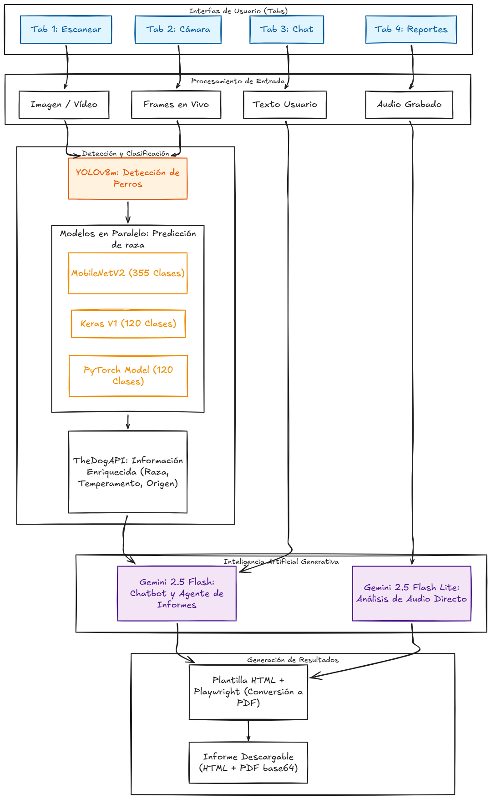

# 🐶 PawSense

PawSense es una aplicación de inteligencia artificial que analiza **imágenes, vídeos, GIFs y transmisiones en tiempo real** para estimar la raza de un perro. Además, permite generar **informes veterinarios para empresas** y **informes de adiestramiento para usuarios particulares**.

El sistema utiliza modelos de visión por computador para detectar rasgos morfológicos y generar una **predicción probabilística**, mostrando el porcentaje estimado de cada raza identificada.

## 📌 Enlaces de interés

| Tipo | Descripción | Enlace |
| :--- | :--- | :--- |
| 🌍 **Web** | Aplicación desplegada en producción | [Ir al sitio](https://pawsense-iabd.vercel.app/) |
| 📽️ **Vídeo** | Vídeo explicativo del proyecto en YouTube | [Ver Video](#) |

## 📱 ¡Pruébalo ahora!

Escanea este código QR para descargar la última versión de **PawSense** para Android:

  
   
  Escanea con la cámara de tu móvil 🐾

 

## 🚀 Características

- Análisis de imágenes  
- Procesamiento de vídeo y GIF  
- Detección en tiempo real  
- Predicción probabilística de razas  
- ChatBot conversacional integrado  
- Agente de IA generador de informes (Veterinario / Adiestramiento)  

 

## 🛠 Tecnologías

- **Detección**: YOLOv8m (fine-tuned)  
- **Clasificación**: MobileNetV2 · EfficientNet-B0 · CNN propia (Keras)  
- **IA Generativa**: Gemini 2.5 Flash / Flash Lite  
- **Backend**: Python · FastAPI  
- **Frontend**: Angular 19 · Angular Material · Ionic
- **Generación PDF**: Playwright  
- **API externa**: TheDogAPI
 

 

https://github.com/user-attachments/assets/72b53ea6-716d-4ac3-a272-696e7ca3c787

 

---

## Previews de la Aplicación

A continuación se presentan demostraciones visuales de las funcionalidades principales del sistema:

| Módulo | Enlace al Vídeo |
|:--- |:--- |
| Chatbot Conversacional | [Reproducir Demostración](https://github.com/user-attachments/assets/fc40cfd2-b669-45ab-ba9c-6ed1a8efa64a) |
| Predicción de Imágenes | [Reproducir Demostración](https://github.com/user-attachments/assets/50903328-a7ea-42e0-b749-01c82d530881) |
| Agente de Informes | [Reproducir Demostración](https://github.com/user-attachments/assets/500cad2c-506f-4fbe-9bac-e0fb7dc1d528) |
| Análisis de Vídeo | [Reproducir Demostración](https://github.com/user-attachments/assets/0ede8214-1a7b-46f3-a348-fa5ee8ebc40e) |

 

## 🧠 ¿Cómo funciona?

### Análisis y Predicción de Razas
1. **Entrada de Datos**: Procesamiento de archivos multimedia (imágenes, vídeos, GIFs) o captura de frames mediante la cámara en tiempo real.
2. **Detección de Objetos**: Localización y segmentación del ejemplar canino utilizando el modelo **YOLOv8m**.
3. **Clasificación Multimodelo**: Análisis simultáneo de rasgos morfológicos mediante tres modelos de visión por computador en paralelo. Un algoritmo de consenso unifica los resultados para ofrecer una predicción probabilística final.
4. **Enriquecimiento de Información**: Consulta automática a **TheDogAPI** para recuperar metadatos específicos como temperamento, esperanza de vida y rasgos característicos.

### Interacción Mediante Chatbot
5. **Interfaz Conversacional**: Sistema de chat integrado para la resolución de consultas sobre la predicción obtenida o cuidados generales.
6. **Gestión de Contexto**: El asistente mantiene el historial de la sesión y los datos técnicos de la detección para ofrecer respuestas precisas mediante streaming de texto.

### Generación Inteligente de Informes
7. **Exportación a Documento**: El Agente de IA procesa la información técnica y genera archivos PDF especializados:
    * **Informe Veterinario**: Enfocado en predisposiciones genéticas, salud preventiva y cuidados médicos sugeridos.
    * **Informe de Adiestramiento**: Centrado en pautas conductuales, técnicas de refuerzo y socialización.
8. **Procesamiento de Voz**: Capacidad de generar informes a partir de grabaciones de audio, realizando transcripción automática y extracción de entidades relevantes para el documento final.

 

## 🏗️ Pipeline del Sistema

A continuación se detalla el flujo técnico desde la entrada de datos hasta la generación de los informes finales:

 

## 📚 Recursos utilizados

Para el desarrollo de PawSense se han empleado los siguientes conjuntos de datos, APIs y documentación técnica:

- [Manual y Documentación Oficial Angular](https://angular.dev/docs)
- [Web Oficial TheDogAPI](https://thedogapi.com/)
- [Manual de integración TheDogAPI](https://docs.thedogapi.com/)
- [Documentación de Gemini API](https://ai.google.dev/gemini-api/docs)
- [Manual de Playwright Python](https://playwright.dev/python/docs/api/class-page#page-pdf)

## ⚖️ Legal Notice
**Copyright © 2026 PawSense Team.**

This project is **Proprietary and Confidential**. All rights are reserved to:
* **Víctor Jiménez Guerrero** (@vjimgue)
* **Enrique Moreno Alcántara** (@enri081)
* **Denisa Ramona Belean** (@denibel04)
* **Carlos Cerezo López** (@Carloscl2005)

Unauthorized use, distribution, or reproduction of this Software is strictly prohibited.
